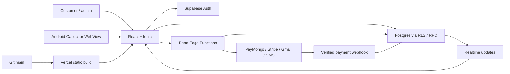

# LS Customs — whole-project structure review and run guide

Reviewed 2026-10-08. This is a source-based map of the current project, with excerpts from actual files. It is not a claim that every line, external service, or device has been independently audited. Paths are relative to the LS-Customs application directory inside the parent Git repository. No passwords, OTPs, API secrets, or session tokens are included.

## 1. Runtime and repository map

| Area | Files | Responsibility |
|---|---|---|
| Workspace orchestration | `package.json`, `turbo.json`, `package-lock.json` | npm workspaces; Turbo delegates build/typecheck/test tasks. |
| Browser application | `apps/web/src`, `apps/web/public`, `apps/web/vite.config.ts` | React 18, Ionic shell, Vite; renders customer/admin interfaces. |
| Android wrapper | `apps/web/capacitor.config.ts`, `apps/web/android` | Capacitor embeds the built `dist` application in Android. |
| Database and Auth | `apps/backend/supabase/migrations`, `config.toml` | PostgreSQL schema, RLS, transactional booking RPCs, triggers; Supabase Auth identities. |
| Server endpoints | `apps/backend/supabase/functions/*/index.ts` | Deno Edge Functions for privileged operations and external providers. |
| Shared types | `packages/shared-types/src/database.types.ts`, `domain.types.ts`, `index.ts` | Database/domain contracts exported to frontend. |
| Shared compiler configuration | `packages/config` | TypeScript base settings and ESLint preset. |
| Documentation | `docs` | Design/specification/API/schema records; older documents may describe planned rather than current functionality. |
| Local evidence | `artifacts` | Simulation report and test evidence; APK and private/local diagnostic outputs should not be blindly committed. |
| Commit protection | `.githooks/pre-commit`, backend `scripts/check-secrets.mjs` | Checks staged content for credentials. |



Vercel hosts the SPA. Supabase owns the database, Auth, Realtime and Edge Functions. A Git/Vercel deploy does not deploy Supabase migrations or functions. Existing APKs contain a previously bundled web build; deploying Vercel does not update those binaries.

## 2. Startup, routing and sessions

`apps/web/index.html` loads `src/main.tsx`. The entry point mounts StrictMode, Ionic, the toast provider and Suspense. `App.tsx` resolves URLs and switches customer/admin/public views. Large booking/profile/admin panels use lazy imports. `RootErrorBoundary` in `App.tsx:76` and admin pane boundaries render recovery UI when a React render throws; the generic error screenshot alone cannot identify the underlying exception.

**Location:** `apps/web/src/main.tsx:14`

```tsx
createRoot(document.getElementById('root')!).render(
  <StrictMode>
    <IonApp>
      <ToastProvider>
        <Suspense fallback={<div role="status" style={{ padding: 24 }}>Loading LS Customs…</div>}><App /></Suspense>
      </ToastProvider>
    </IonApp>
  </StrictMode>,
);
```

The Supabase browser client requires the two client-safe Vite variables. Browser sessions use localStorage; native sessions use Capacitor Preferences. Neither store is a place for a service-role key. RLS remains necessary regardless of UI visibility or locally cached roles.

**Location:** `apps/web/src/supabaseClient.ts:25`

```tsx
export const supabase = createClient(supabaseUrl, supabaseAnonKey, {
  auth: {
    storage: Capacitor.isNativePlatform() ? customStorage : window.localStorage,
    autoRefreshToken: true,
    persistSession: true,
    detectSessionInUrl: true,
  },
});
```

`hooks/useAuth.ts` restores the customer identity and loads its profile. `components/auth/AuthModal.tsx` distinguishes registration from login. Email login disables automatic account creation; `utils/authOtp.ts` calls the phone endpoint. `customer-phone-otp/index.ts` resolves verified SMS to the original account, including a Google account with a phone added later. Ambiguous/conflicting contacts are rejected rather than merged. `AccountSetup.tsx` collects missing profile information after a genuine registration.

Admin entry uses `AdminLogin.tsx` and `hooks/useAdminAuth.ts`: Auth validates credentials, then the hook checks the profile role. The Auth change callback defers its profile request to avoid awaiting another Auth-dependent request inside the callback. Database RLS and privileged endpoint role checks enforce authorization. `AdminAccountSecurity.tsx` lets the human admin set a private password; passwords are not logged or written to source.

## 3. Customer vehicle rental

`views/Rentals.tsx` obtains fleet data from `useCustomerVehicles.ts`, checks availability through `useVehicleAvailability.ts`, displays `VehicleCard.tsx`, and submits an idempotent booking RPC. `create_vehicle_booking` in `20261006120000_qa_booking_security.sql` derives price/discount from the database, rejects overlaps and creates an unpaid hold. Browser totals are presentation, not an authoritative charge.

**Location:** `apps/web/src/components/views/Rentals.tsx:199`

```tsx
    const { data, error: insertError } = await supabase.rpc('create_vehicle_booking', {
      p_request_id: bookingAttempt.current.id, p_vehicle_id: vehicle.id,
      p_start: startDate, p_end: endDate, p_promo_code: activePromo?.code ?? null,
    })
    bookingInFlight.current = false
    setCreatingBooking(false)
    if (insertError || !data) {
      const msg = insertError?.message ?? 'Booking could not be created.'
      if (msg.toLowerCase().includes('no_overlapping_bookings') || msg.toLowerCase().includes('conflicting key')) {
        setBookingError(`${vehicle.name} is already booked for those dates. Try a different vehicle or shift your dates.`)
```

`RentalPayment.tsx` and `usePaymentIntent.ts` optionally start checkout; `PaymentForm.tsx` handles the provider UI. `usePaymentStatus.ts` subscribes to the payment row. The customer's Bookings panel updates from persisted bookings even before payment. No checkout was performed in the production simulation.

`VehicleImage.tsx` displays the actual uploaded image when present and an explicitly labelled illustration when absent/broken. It cannot create genuine fleet photographs; operators must upload those.

## 4. Customer mechanic booking and location

`views/mechanic/MechanicBookingFlow.tsx` coordinates category, service, location, schedule, review, payment and confirmation steps. `StepLocation.tsx` requires actual coordinates before progressing. A saved text address without GPS requires a confirmed map pin. `useMechanicDistance.ts` shows the dispatch-hub estimate; `StepReview.tsx` uses the same distance and fee, rather than an invented 3.5 km. An available mechanic is not a confirmed assignment.

**Location:** `apps/web/src/components/views/mechanic/MechanicBookingFlow.tsx:212`

```tsx
      const { data, error: insertError } = await supabase.rpc('create_service_booking', {
        p_request_id: requestId, p_service_id: service.id, p_scheduled_at: scheduledAt,
        p_address_id: address.source === 'default' ? effectiveAddressId : null,
        p_lat: address.source !== 'default' && hasPin ? address.pin_lat : null, p_lng: address.source !== 'default' && hasPin ? address.pin_lng : null,
        p_notes: 'Address: ' + address.line1 + ', ' + address.city,
        p_promo_code: activePromo?.code ?? null,
      })
      if (insertError) throw insertError
      if (!data?.id) throw new Error('Booking was not created')
      bookingId = data.id
      status = data.status as ServiceBooking['status']
      serverTotal = Number(data.total_price)
```

The database RPC owns catalog pricing, travel quotation, appointment limits and idempotency. `address_id` is retained when the customer chooses a saved address with valid coordinates. Custom pins include the entered address text in notes. The new address migration replaces historical `(0,0)` placeholder pairs with null coordinates and permits text-only saved addresses. The service RPC already rejects null coordinates. Changing saved address text clears its old coordinates so a different street cannot reuse an old pin.

`ActiveBookingTracker.tsx`, `useLiveLocationForActiveBooking.ts` and the map components display authorized live tracking. Source data must distinguish approximate map context from a confirmed customer location. Historical simulation pins cannot be corrected automatically without customer confirmation.

## 5. Admin management and workflow

`AdminLayout.tsx` mounts panels once and hides inactive panels. It no longer mounts a second overview through a settings fallback. The sidebar exposes fleet, services, mechanics, users, bookings, tickets, revenue and audit logs. Keeping all panels mounted trades faster switching for more initial requests and subscriptions.

`hooks/useAdminData.ts` centralizes reads and management mutations. The booking panel joins catalog/customer details and maps mechanics using `mechanic_profiles.id`, which is the profile identity; there is no `mechanic_profiles.user_id` column. Approval and assignment remain distinct persisted actions. Assignment is available from both pending and confirmed states, with server capacity checks. Edit persists only rental pickup instructions or service notes; it does not silently edit schedule or money.

**Location:** `apps/web/src/components/admin/AdminBookings.tsx:1173`

```tsx
      {editingBooking && <div className="admin-modal-overlay"><form className="admin-modal" role="dialog" aria-label="Edit booking instructions" onSubmit={event => {
        event.preventDefault()
        if (savingEdit) return
        setSavingEdit(true)
        const rental = 'vehicle_id' in editingBooking
        void Promise.resolve(supabase.from(rental ? 'vehicle_bookings' : 'service_bookings')
          .update(rental ? { pickup_location: editingText.trim() } : { notes: editingText.trim() })
          .eq('id', editingBooking.id).select('id').single()).then(async ({ error }) => {
            if (error) { setAssignmentNotice({ type: 'warning', text: error.message }); return }
            setEditingBooking(null)
            await Promise.all([refetchVehicles(), refetchServices()])
          }).finally(() => setSavingEdit(false))
```

Details load actual succeeded payment rows. No UUID-derived cash amount/change or current-clock booking timestamp is displayed. Completing a job changes booking status; it does not create a payment. `useAdminRevenueData.ts` is read-only and sums succeeded payment records. Revenue viewing cannot mark a pending payment succeeded.

`AdminTransactions.tsx` allows explicit manual payment recording after operator verification. `useAdminPayments.ts` calls the refund provider before considering a refund successful, and surfaces receipt failures separately from loading failures. `AdminTickets.tsx` manages support; `AdminAuditLogs.tsx` and `RecordAuditTrail.tsx` expose recorded changes. `flag-user` is destructive, with cascading profile-related data removal; account suspension/deletion merits a separate product decision and recovery design before real use.

## 6. Payment and email boundaries

`create-payment-intent/index.ts` checks booking ownership/state and allowed return origins, then uses `_shared/paymentProvider.ts`. `payment-webhook/index.ts` verifies signatures before reconciling paid status through SQL. `_shared/checkout.ts` protects return URLs and provider session reuse. `refund-payment/index.ts` validates the transaction and provider response.

`send-receipt/index.ts` requires a real succeeded payment owned by the customer or accessible to an admin. It derives recipient and amount from backend records and uses a delivery cooldown. `send-booking-confirmation/index.ts` sends an approval acknowledgment for approved bookings, including unpaid ones; its template explicitly states that it is not payment certification.

**Location:** `apps/backend/supabase/functions/send-booking-confirmation/index.ts:38`

```tsx
    const result = await send({
      documentKind: 'confirmation', customerName: customer?.full_name ?? 'Customer', customerEmail: recipient.user.email,
      bookingId: booking.id, bookingType: rental ? 'rental' : 'service', amount: Number(booking.total_price),
      scheduledDate: rental ? `${booking.start_date} – ${booking.end_date}` : booking.scheduled_at,
      status: 'Booking approved — payment not certified', itemTitle: rental ? 'Vehicle rental' : 'Mobile mechanic service',
    });
    if (!result.success) return reply(null, { code: 'DELIVERY_ERROR', message: 'Confirmation email failed. Retry later.' }, 502);
    return reply({ accepted: true, providerId: result.id, bookingId: booking.id, documentKind: 'confirmation' }, null);
  } catch (error) {
```

`_shared/resend.ts` retains historical function names but actually sends through Gmail SMTP/Nodemailer using server secrets. Text and HTML values are escaped; SMTP timeouts bound stalled requests. Provider acceptance is not proof of inbox delivery.

## 7. Notifications, retries and realtime

Booking triggers author notification rows. `dispatch-notification/index.ts` accepts verified service/admin callers, or a customer retrying their own existing notification. Customer-supplied recipient/content overrides are ignored. A database guard permits a customer to change only the notification read flag. Admins can inspect delivery metadata under a tested RLS policy.

SMS is dispatched for assignment events. TextBee, Semaphore and Twilio are tried in sequence when configured. No-gateway/failure paths no longer report simulated success. Provider response bodies, phone numbers and message text are not logged. Claims serialize concurrent dispatch; partial retries retain successful channels so an email is not repeated merely because SMS failed. `delivery_state`, `channels_dispatched`, `simulated`, and errors represent what was actually accepted, not final handset delivery.

**Location:** `apps/backend/supabase/migrations/20261008141000_notification_delivery.sql:6`

```sql
create function public.reserve_notification_dispatch(p_id uuid)
returns boolean language plpgsql security definer set search_path = '' as $$
declare reserved uuid;
begin
  update public.notifications set metadata=coalesce(metadata,'{}'::jsonb)
    || jsonb_build_object('dispatch_started_at',now())
  where id=p_id and (coalesce(metadata->>'dispatched','false')<>'true' or metadata->>'simulated'='true' or metadata->>'delivery_state'='failed')
    and (metadata->>'dispatch_started_at' is null
      or (metadata->>'dispatch_started_at')::timestamptz < now()-interval '2 minutes')
  returning id into reserved;
  return reserved is not null;
end;
```

`useCustomerNotifications.ts`, `useCustomerBookings.ts`, `useRecentBookings.ts`, `useAdminOverviewStats.ts`, `useAdminRevenueData.ts`, `useAdminPayments.ts` and `usePaymentStatus.ts` use instance-specific channel names and remove channels during cleanup. This avoids attaching a second set of callbacks to an already subscribed shared channel.

## 8. Other modules and interfaces

| Module | How it fits |
|---|---|
| `views/Profile.tsx`, `hooks/useProfile.ts` | Profile phone/name and default address editing; text-only addresses are explicitly unlocated. |
| `views/Bookings.tsx`, `bookings/BookingCalendar.tsx` | Customer rental/service history, details and schedule. |
| `hooks/useServices.ts`, `useTrendingServices.ts` | Active service catalog and dashboard suggestions. |
| `useFavoriteVehicles.ts` | Customer vehicle favorites scoped by RLS. |
| `useCustomerSiteSettings.ts`, `CustomerSettingsEditor.tsx` | Customer content settings and admin content editing. |
| `create-ticket/index.ts` | Authenticated support ticket creation. |
| `chatbot/index.ts` | Server-side AI helper; external model configuration stays server-side. |
| `geocode-address/index.ts`, map components | Address/map services; geocoding does not automatically prove the customer's dispatch location. |
| `textbee-sms-hook/index.ts` | SMS-provider auth hook; distinct from booking-notification dispatch. |
| `src/data`, `types.ts`, style sheets | UI catalog defaults, display types and styling; business prices/authorization come from backend records. |
| `_shared/cors.ts`, `_shared/supabaseClient.ts` | Structured response/CORS helpers and server-only Supabase clients. |

## 9. How to run

From the application directory, use Node matching `package.json` (at least 18; Android tooling has its own requirements):

```powershell
npm ci
npm run dev --workspace=apps/web
npm run web:build
npm run typecheck --workspace=apps/backend
npm run test --workspace=apps/backend
```

The frontend reads `apps/web/.env.local` containing `VITE_SUPABASE_URL` and `VITE_SUPABASE_ANON_KEY`. A linked remote backend works for frontend-only development. Never place server secrets in `VITE_*` variables.

For a local Supabase stack, install/run Docker and the Supabase CLI, then use `npm run db:start`; `npm run functions:serve` reads backend `supabase/.env`. `npm run dev` starts local Supabase and both functions/web processes. CLI start alone does not reconfigure the frontend to the local backend: set the frontend URL/anon key explicitly. `npm run db:reset` destroys/recreates local development data; do not run against production. Backend checks use Deno 2 (or `DENO_PATH`) plus PGlite for PostgreSQL fixture tests.

Android build from a terminal with the Android SDK and a compatible Java/Gradle installation:

```powershell
npm run web:build
cd apps/web
npx cap sync android
cd android
.\gradlew.bat assembleDebug
```

The debug APK is under `apps/web/android/app/build/outputs/apk/debug`. Release distribution requires the existing signing setup and a release build; don't commit signing secrets. `capacitor.config.ts` uses `webDir: 'dist'`, so a rebuild/sync is mandatory to distribute these frontend changes. Mobile viewport browser tests do not validate native OTP deep links, permissions, background restoration or physical handset SMS.

## 10. Deployment and verification

Deploy forward-only migrations using `supabase db push --workdir apps/backend`, and deploy affected Edge Functions separately. Use `--dry-run` first. Historical published seeded passwords are disabled only when the stored password still matches a published value; rotated private passwords are preserved. Arrange private admin access before applying that migration. Because delivery/GPS migrations are already applied, the remaining earlier security migration needs `supabase db push --include-all --workdir apps/backend` after private access is confirmed.

Push reviewed application changes to Git `main`; the connected Vercel project builds `apps/web` and rewrites SPA URLs to index.html. Verify a READY production deployment whose Git SHA matches the pushed commit. A successful CLI push is not itself proof of a successful deployment. Re-run isolated browser tests against the deployed bundle and inspect the live route.

## 11. Review findings and remaining limits

Corrected: phantom payments/revenue, invented admin cash/timestamps, nonexistent mechanic identity column, approval-to-assignment dead end, nonfunctional edit action, inconsistent distance review, unknown map coordinates, duplicate realtime registrations, unchecked function envelopes, optimistic refunds, simulated SMS success, notification spoofing/duplicate dispatch, and exposed seeded admin passwords. The simulation report records the pre-fix evidence; a remediation report records final checks/deployment.

Remaining structural debt: `App.tsx`, `AdminBookings.tsx` and `useAdminData.ts` combine many responsibilities; extract narrow domain hooks/modules when making future substantial changes. Shared generated types must be refreshed after schema changes. Some casts and older static datasets are retained; they are not authoritative payment/authorization sources. Initial production JavaScript remains large; the build reports a chunk-size warning, so performance is not certified by the functional tests. Older `ARCHITECTURE.md` sections call the now-existing frontend a future phase; use this source map for current runtime behavior.

Verification limits: no real charge/refund was performed; no new physical APK was exercised in this remediation; original email/SMS arrival was confirmed by the user, not by inbox/handset inspection. Gmail/SMS provider acceptance cannot establish delivery/read status. Fleet photographs, a real confirmed customer pin for historical bookings, provider delivery receipts, and native device verification require real operator/device evidence. These limits cannot honestly be eliminated through source changes alone.
